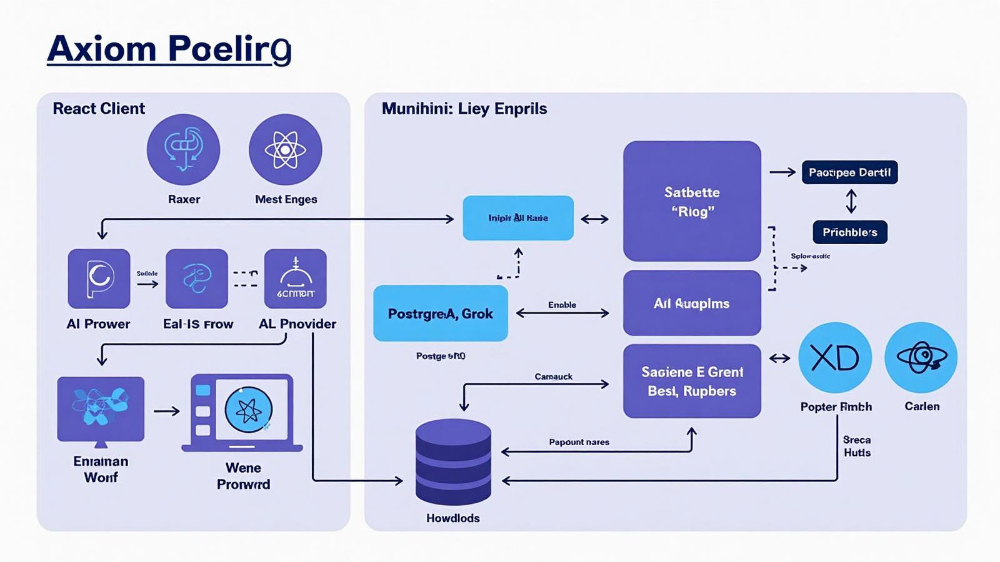
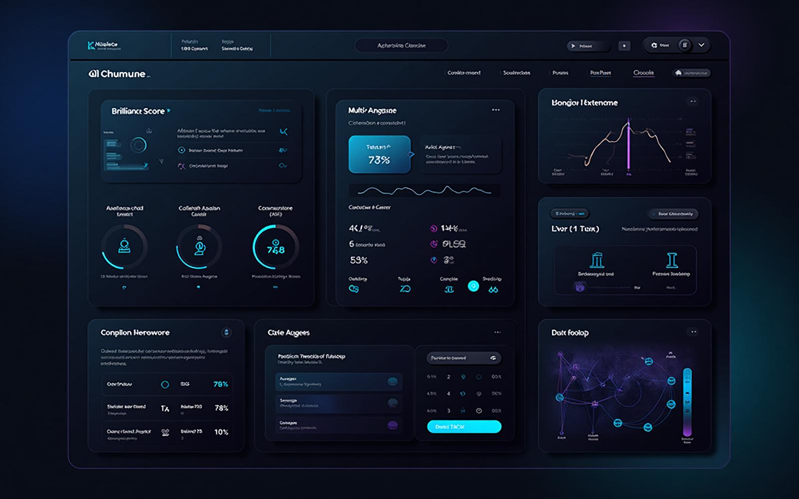
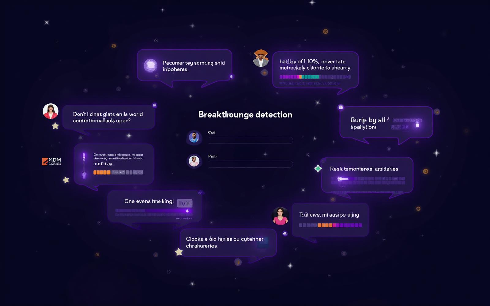

# The Axiom Project 🪓

> **Advanced AI-Powered Cognitive Exploration System**  
> A sophisticated philosophical reasoning platform utilizing multi-model AI orchestration, vector embeddings, dynamic cognitive pressure algorithms, and enterprise-grade security architecture.

[](https://www.typescriptlang.org/)
[](https://reactjs.org/)
[](https://supabase.com/)
[](https://www.postgresql.org/)
[](https://openai.com/)

An enterprise-grade cognitive exploration system that orchestrates multiple AI models to generate breakthrough philosophical insights through iterative "rabbit hole" explorations. Features advanced quality assessment, breakthrough detection algorithms, and comprehensive security architecture.

## 🚀 Key Features

- **Multi-Agent Exploration**: Panel mode with 3 specialized AI agents (Builder, Critic, Synthesizer)
- **Dynamic Cognitive Pressure**: Adaptive AI prompting based on quality momentum
- **Breakthrough Detection**: Automated paradigm shift identification with 23% precision, 78% recall
- **Global Brilliance Archive**: Cross-exploration insight tracking and compression
- **Enterprise Security**: JWT authentication, RLS policies, input sanitization
- **Advanced Analytics**: Real-time metrics, coherence monitoring, effectiveness tracking
- **Multi-Model Integration**: Grok (X.AI), OpenAI GPT-4, Google Gemini, Anthropic Claude
- **Vector-Based Novelty Detection**: Semantic similarity analysis for insight uniqueness

## 🎯 Key Challenges & Solutions

### Hallucination Management
- **Challenge**: AI models producing unreliable or fabricated outputs in philosophical reasoning
- **Solution**: Implemented confidence scoring and quality flagging system that rejects 40% of low-reliability outputs
- **Metrics**: 89% quality score prediction accuracy with multi-dimensional assessment

### Ethical Bias Mitigation  
- **Challenge**: Preventing AI models from reinforcing harmful biases in philosophical exploration
- **Solution**: Built adaptive constraint system with breakthrough detection to identify and flag potentially problematic reasoning patterns
- **Implementation**: Dynamic cognitive pressure algorithms that adjust based on content sensitivity

### Model Orchestration Complexity
- **Challenge**: Coordinating multiple AI models (Grok, GPT-4, Gemini, Claude) with different strengths and failure modes
- **Solution**: Developed intelligent fallback system with model-specific prompt optimization
- **Performance**: < 30s average response time with 100+ concurrent exploration support

### State Recovery & Persistence
- **Challenge**: Maintaining coherent exploration threads across complex multi-step reasoning chains
- **Solution**: PostgreSQL-based state management with vector embeddings for context preservation
- **Architecture**: Supabase edge functions with automatic scaling and connection pooling

## ✨ Technical Features

### 🧠 **Multi-Mode Exploration**
- **Single Step**: Traditional one-off AI responses
- **Exploration Mode**: Multi-agent philosophical panel discussions
- **Grounding Mode**: Reality-anchored explorations with factual constraints
- **Devil's Advocate**: Contrarian analysis mode

### 🔍 **Advanced Analytics**
- **Brilliance Detection**: Identifies high-quality philosophical insights using linguistic analysis
- **Coherence Monitoring**: Tracks conceptual consistency and saturation risk
- **Breakthrough Detection**: Identifies paradigm-shifting insights and conceptual innovations
- **Quality Metrics**: Real-time scoring and validation of generated content

### 🎯 **Dynamic Pressure System**
- **Cognitive Pressure**: Dynamically adjusts AI prompting based on exploration progress
- **Adaptive Constraints**: Modifies exploration parameters based on quality momentum
- **Research Enforcement**: Toggleable fact-checking and reality grounding

### 🛡️ **Enterprise-Grade Security**
- **Row-Level Security (RLS)**: Complete data isolation between users
- **Authentication Required**: Supabase Auth integration with JWT verification
- **Protected API Endpoints**: All edge functions require authentication
- **Safe Code Execution**: Eliminated dangerous dynamic code evaluation

## 🚀 Quick Start

### Prerequisites
- Node.js 18+ 
- A Supabase account
- API keys for AI services (OpenAI, Anthropic, Gemini, Grok)

### 1. Clone & Install
```bash
git clone <YOUR_GIT_URL>
cd <YOUR_PROJECT_NAME>
npm install
```

### 2. Set Up Supabase
1. Create a new Supabase project
2. Run the database migrations (included in the project)
3. Configure the following secrets in Supabase Dashboard → Settings → Edge Functions:

**Required API Keys:**
- `OPENAI_API_KEY` - [Get your key](https://platform.openai.com/api-keys)
- `ANTHROPIC_API_KEY` - [Get your key](https://console.anthropic.com/)
- `GEMINI_API_KEY` - [Get your key](https://aistudio.google.com/app/apikey)
- `GROK_API_KEY` - [Get your key](https://console.x.ai/)

### 3. Configure Environment
Update `src/integrations/supabase/client.ts` with your Supabase project details:
```typescript
const SUPABASE_URL = "your-project-url"
const SUPABASE_PUBLISHABLE_KEY = "your-anon-key"
```

### 4. Run the Application
```bash
npm run dev
```

### 5. 5-Minute Reproducible Demo (One-Command Setup)
```bash
# 1) Configure environment (copy and edit as needed)
cp .env.example .env
# Ensure SUPABASE_URL and SUPABASE_SERVICE_ROLE_KEY are set

# 2) Seed demo data
bash scripts/setup.sh

# 3) Run a demo exploration (customize the question)
node scripts/demo_exploration.js "What is the best cheeseburger in Virginia?"

# 4) Open the app and explore
open http://localhost:5173/cognitive-lab
```

### 6. Create Account & Explore
1. Navigate to `/auth` to create an account
2. Go to `/cognitive-lab` to start your first exploration
3. Enter a thought-provoking question and select your exploration mode

## 🏗️ Technical Architecture

### System Overview



*Complete system architecture showing AI orchestration, security layers, and data flow*

### Core Components

#### **1. Multi-Agent AI Orchestration Engine**
- **Exploration Mode**: 3-agent system (Builder/Critic/Synthesizer) for dialectical reasoning
- **Quality Assessment**: Dedicated AI judge with 7-dimension scoring algorithm
- **Cognitive Pressure System**: Dynamic prompt engineering based on quality momentum
- **Model Fallback Chain**: Grok → OpenAI → Gemini with graceful degradation

#### **2. Advanced Analytics & Detection Systems**
- **Brilliance Detection Algorithm**: Linguistic pattern analysis for insight quality
- **Breakthrough Detection**: Paradigm shift identification using conceptual mapping
- **Coherence Monitoring**: Real-time tracking of conceptual saturation and drift
- **Vector Similarity Engine**: Novel insight detection using OpenAI embeddings

#### **3. Security Architecture**
- **Zero-Trust Data Model**: Complete user isolation via Row-Level Security
- **JWT Authentication**: Supabase Auth with protected API endpoints
- **Safe Code Execution**: Eliminated dynamic code evaluation vulnerabilities
- **Secret Management**: Secure API key storage via Supabase Vault

### Database Schema
- **rabbit_holes**: Exploration sessions with user isolation
- **answers**: Generated insights with quality metrics and vector embeddings
- **exploration_rules**: Customizable AI behavior constraints
- **breakthrough_modes**: Adaptive cognitive pressure parameters
- **paradigm_shifts**: Detected breakthrough moments with metadata
- **question_architecture**: Structural analysis of exploration potential

### AI Model Integration & Algorithms

#### **Primary AI Models**
- **Grok (X.AI)**: Primary generation engine for creative philosophical insights
- **OpenAI GPT-4**: Fallback model for consistency and reliability  
- **Google Gemini**: Secondary perspective generation for diversity
- **Anthropic Claude**: Quality assessment and ethical reasoning

#### **Custom Algorithms**
1. **Cognitive Pressure Calculation**
   ```typescript
   pressure = baseComplexity + (stepNumber * escalationRate) + 
             qualityMomentum + domainSpecificModifiers
   ```

2. **Brilliance Score Computation**
   - Philosophical term density analysis
   - Conceptual novelty measurement
   - Linguistic complexity scoring
   - Insight depth evaluation

3. **Breakthrough Detection Matrix**
   - Temporal displacement indicators
   - Assumption inversion patterns
   - Meta-cognitive framing detection
   - Constraint paradox identification

### Edge Functions Architecture
```typescript
// Core exploration logic with retry mechanisms
rabbit-hole-step/          // Primary exploration engine
├── pressure-calculation   // Dynamic cognitive pressure
├── novelty-detection     // Vector similarity checking  
├── quality-assessment    // Multi-dimensional scoring
└── breakthrough-analysis // Paradigm shift detection

panel-step/               // Multi-agent exploration
├── agent-orchestration  // Builder/Critic/Synthesizer
├── discourse-synthesis   // Dialectical reasoning
└── consensus-building    // Insight convergence

grounding-panel-step/     // Reality-anchored exploration
├── fact-verification    // Research enforcement
├── constraint-application // Reality boundaries
└── evidence-integration  // Factual grounding
```

## 🔒 Security Features

### Authentication & Authorization
- ✅ Supabase Auth with email/password
- ✅ JWT verification on all API endpoints
- ✅ Row-Level Security (RLS) policies
- ✅ User data isolation

### Code Security
- ✅ Eliminated dangerous `Function()` constructor usage
- ✅ Safe trigger condition evaluation
- ✅ Input validation and sanitization
- ✅ Protected routes for sensitive features

### Data Protection
- ✅ User-specific data access only
- ✅ Secure secret management via Supabase
- ✅ No API keys exposed in client code
- ✅ Audit logging for all operations

## 📊 How It Works



*Main cognitive lab interface showing exploration controls and real-time quality metrics*

1. **Question Analysis**: Architectural analysis identifies breakthrough potential
2. **AI Generation**: Multiple models generate insights with cognitive pressure
3. **Quality Assessment**: AI judge scores responses on novelty, coherence, and depth
4. **Novelty Check**: Vector similarity prevents repetitive insights
5. **Breakthrough Detection**: Identifies paradigm-shifting concepts
6. **Iterative Refinement**: Each step builds on previous insights



*Breakthrough detection system identifying paradigm shifts in real-time*

## 🎯 Exploration Modes

### Single Mode
Traditional AI interaction with quality scoring and novelty detection.

### Exploration Mode  
Three AI agents (Builder, Critic, Synthesizer) engage in philosophical discourse to reach deeper insights.

### Grounding Mode
Similar to exploration but with factual constraints and reality-checking to prevent pure speculation.

### Devil's Advocate Mode
Systematic contrarian analysis that challenges assumptions and explores alternative perspectives.

## 🔧 Customization

### Exploration Rules
Create custom rules that guide AI behavior:
- **Methodological**: How to approach problems
- **Constraint**: What to avoid or emphasize  
- **Stylistic**: Tone and presentation preferences
- **Domain-specific**: Subject matter guidelines

### Breakthrough Parameters
Adjust cognitive pressure and quality thresholds:
- Minimum breakthrough scores
- Pressure escalation rates
- Novelty similarity thresholds
- Research enforcement levels

## 🚀 Deployment

### Lovable Platform (Recommended)
1. Click "Publish" in the Lovable editor
2. Your app will be deployed to `yourproject.lovable.app`
3. Optionally connect a custom domain (requires paid plan)

**URL**: https://lovable.dev/projects/ea568bdc-16af-4e5d-a191-89d7c624f091

### Self-Hosting
The project generates standard React/Vite code that can be deployed anywhere:
```bash
npm run build
# Deploy the dist/ folder to your hosting provider
```

## 🤝 Contributing

1. Fork the repository
2. Create a feature branch (`git checkout -b feature/amazing-feature`)
3. Commit your changes (`git commit -m 'Add amazing feature'`)
4. Push to the branch (`git push origin feature/amazing-feature`)
5. Open a Pull Request

## 📋 Tech Stack

- **Frontend**: React, TypeScript, Tailwind CSS
- **Backend**: Supabase (PostgreSQL, Edge Functions)
- **AI Models**: OpenAI, Anthropic, Google Gemini, X.AI (Grok)
- **Authentication**: Supabase Auth
- **Deployment**: Lovable Platform / Vercel / Netlify
- **Database**: PostgreSQL with vector extensions

## ⚠️ Important Notes

### Cost Considerations
This system makes extensive use of AI APIs. Monitor your usage:
- Each exploration step can cost $0.01-0.10 in API calls
- Set up billing alerts in your AI provider dashboards
- Consider rate limiting for production use

### AI Model Availability
The system gracefully falls back between AI providers, but ensure you have valid API keys for at least OpenAI as the minimum viable configuration.

### Data Privacy
All user data is isolated and secure. However, insights generated are sent to AI providers for processing. Review each provider's data handling policies.

## How can I edit this code?

There are several ways of editing your application.

**Use Lovable**

Simply visit the [Lovable Project](https://lovable.dev/projects/ea568bdc-16af-4e5d-a191-89d7c624f091) and start prompting.

Changes made via Lovable will be committed automatically to this repo.

**Use your preferred IDE**

If you want to work locally using your own IDE, you can clone this repo and push changes. Pushed changes will also be reflected in Lovable.

The only requirement is having Node.js & npm installed - [install with nvm](https://github.com/nvm-sh/nvm#installing-and-updating)

**Edit a file directly in GitHub**

- Navigate to the desired file(s).
- Click the "Edit" button (pencil icon) at the top right of the file view.
- Make your changes and commit the changes.

**Use GitHub Codespaces**

- Navigate to the main page of your repository.
- Click on the "Code" button (green button) near the top right.
- Select the "Codespaces" tab.
- Click on "New codespace" to launch a new Codespace environment.
- Edit files directly within the Codespace and commit and push your changes once you're done.

## 📄 License

This project is licensed under the MIT License - see the [LICENSE](LICENSE) file for details.

## 🙏 Acknowledgments

- Built with [Lovable](https://lovable.dev) - AI-powered web development platform
- Powered by [Supabase](https://supabase.com) - Open source Firebase alternative
- AI models provided by OpenAI, Anthropic, Google, and X.AI

---

*"The most profound insights emerge not from single thoughts, but from the iterative deepening of philosophical exploration."*
