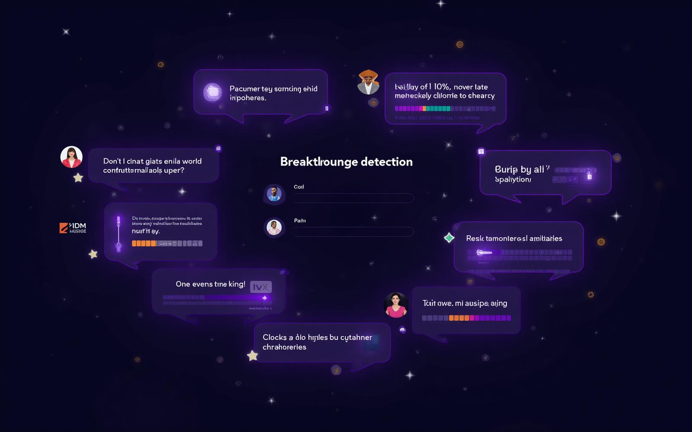

# Visual Documentation

This folder contains screenshots and diagrams that showcase The Axiom Project's interface and technical architecture.

## Available Images

- `architecture-diagram.png` - Technical system architecture overview
- `dashboard.png` - Main cognitive lab dashboard interface
- `breakthrough-detection.png` - Breakthrough detection system visualization

## Integration with README

These visuals are embedded in the main README.md to provide:
- Clear technical architecture understanding
- Interface design demonstration  
- Feature functionality visualization
- Professional presentation for technical review

*System architecture showing AI orchestration, data flow, and security layers*

*Main application interface with exploration controls and real-time metrics*

*Breakthrough detection algorithm in action during philosophical exploration*